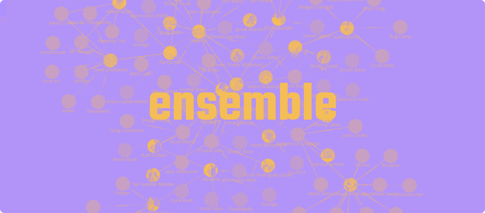
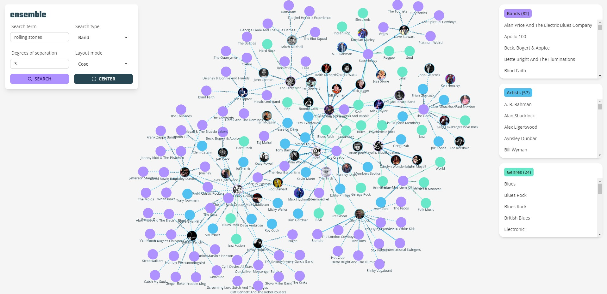
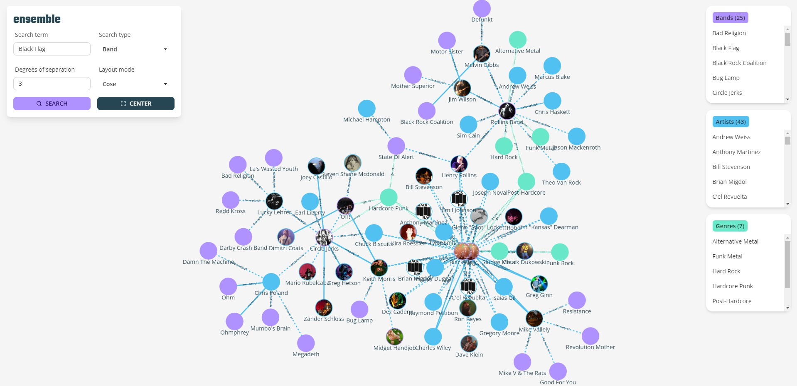
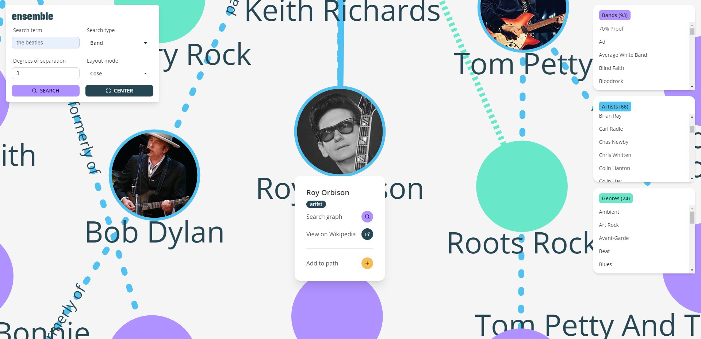
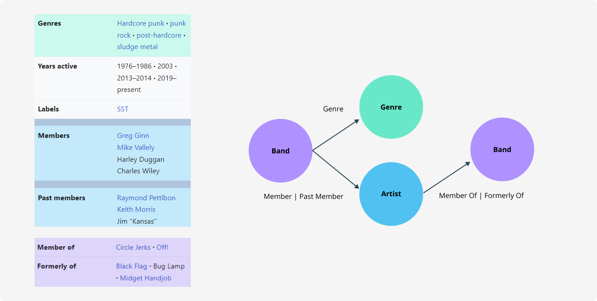
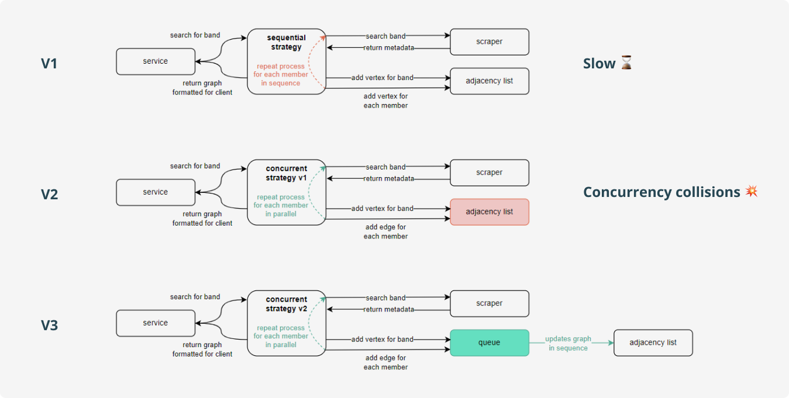
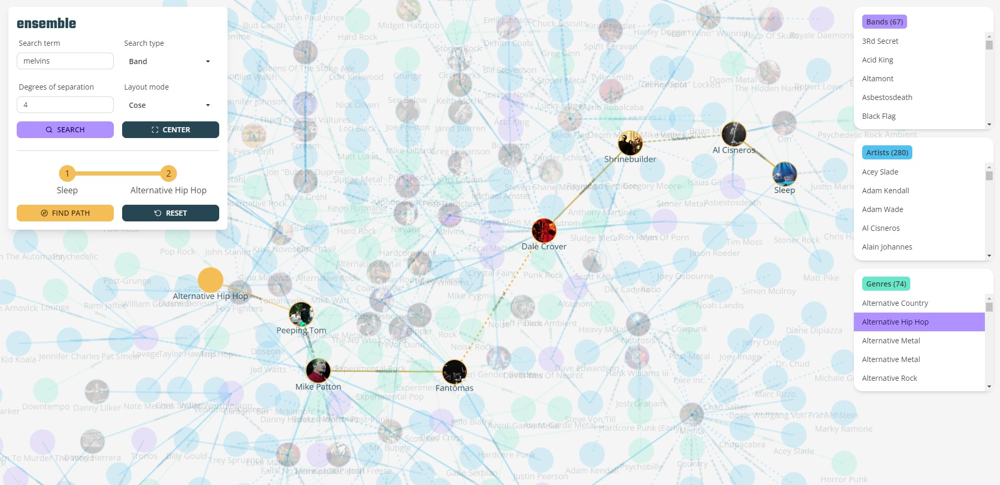
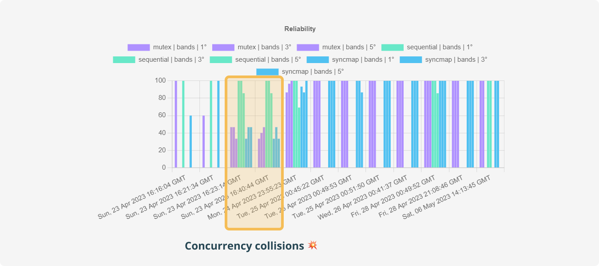

Web application visualising connections between bands, artists and genres.

## Overview

Ensemble uses Wikipedia as a data source by scraping metadata for a given query and recursively visiting relevant links. These relationships are dynamically built up as an adjacency list before being formatted for client consumption once a given degree-of-separation is met.

### Stack

Ensemble is built using the following technologies:

**Client**

- [Svelte + Sveltekit](https://svelte.dev/) - Client framework
- [Tailwind](https://tailwindcss.com/) + [DaisyUI](https://daisyui.com/) - Styling
- [Cytoscape](https://js.cytoscape.org/) - Graph rendering and searching

**API**

- [Go](https://go.dev/) + [Gin](https://gin-gonic.com/) - API framework
- [Colly](https://go-colly.org/) - Web scraping

**Performance testing**

- [Node](https://nodejs.org/en) - tooling
- [K6](https://k6.io/) - performance testing

## Graph relationships

In the band or artist graph, the following relationships are supported in addition to their corresponding data source in the Wikipedia website. The genre graph is a little different, where only genre nodes are currently included.

## Degrees of Separation

To prevent infinite recursion, we need a hard limit how how many times to recursion cycles we'll complete when building the graph. In the Ensemble, this is limit is referred to as _degrees of separation_ from the original target.

## Pathfinding

Currently, Ensemble uses Cytoscape's implementation of the [Floyd-Warshall](https://js.cytoscape.org/#eles.floydWarshall) search algorithm for finding the shortest paths between two nodes. Genre nodes are weighted slightly lower than band or artist nodes to discourage routing via genres for more interesting paths.

## Concurrency

The initial approach when scraping information from Wikipedia and building up the graph was by sequentially visiting each node using depth-first search.
This approach produced a bottleneck awaiting HTTP requests to Wikipedia to retrieve node metadata.

To address this HTTP request bottleneck, node visitations were parallelized using [goroutines](https://go.dev/tour/concurrency/1). This produced a secondary issue, where concurrent read and writes lead to data loss when compared to the graph produced sequentially.

To address concurrent read and write conflicts, graph updates were sequenced using a queue. A Go [channel](https://go.dev/tour/concurrency/2) watches for queue entries and executes graph updates accordingly.

There are a couple of ways we can create thread-safe graphs in Golang; the `sync` package comes with a concurrent-safe [Map](https://pkg.go.dev/sync#Map), or we can implement our own synchronisation using [Mutex](https://pkg.go.dev/sync#Mutex) mutual exclusion locks. We decided to test both approaches to see which would yield the best results when compared to the sequential approach.

## Performance testing

To evaluate which strategy and graph implementation performed the best, we created performance tests using [K6](https://k6.io/). We tested for 3 different factors:

1. **Reliability** - did data loss occur
2. **Latency** - how long did the graph take to generate
3. **Request failure** - did the response return a non-200 status code

These were also evaluated using different numbers of concurrent users and degrees of separation.

A custom test runner was built in Node to execute these tests and format the results in CSV for client display - the charted results can be viewed on the [Ensemble website](https://ryanachten.github.io/ensemble/stats).

## Further information

- [Running ensemble client](./client/README.md)
- [Running ensemble API](./api/README.md)
- [Running ensemble performance tests](./performance/README.md)
